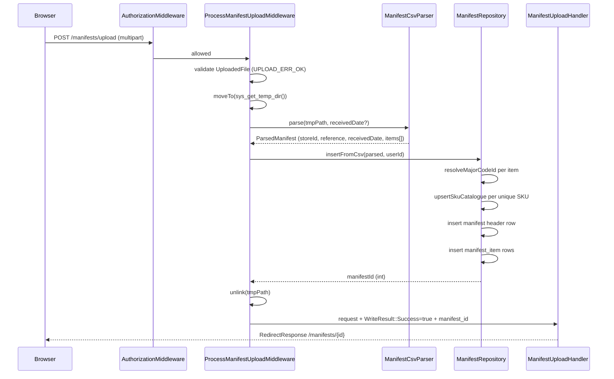

# ims-manifest — Module Documentation

**Package**: `ims/manifest`  
**Namespace**: `Ims\Manifest`  
**Sprint**: sprint-block-3-manifest  
**Status**: In progress — upload pipeline complete; process / scan / finish workflows pending

---

## Purpose

The `ims-manifest` module manages DC truck manifests for the Farmers Store IMS.
A manifest represents a single truck delivery from the distribution centre. Each
manifest has a header (store, DC reference number, received date) and a list of
items (AO number, SKU, VSN, specs, case quantity, damage status).

The current sprint deliverable is the **CSV upload pipeline**: an associate
uploads a DC-generated manifest CSV, the system parses it, upserts any new SKU
and major code catalogue rows, and creates the manifest and item records in the
database.

---

## Module Layout

```
src/ims-manifest/
├── src/
│   ├── ConfigProvider.php
│   ├── RouteProvider.php
│   ├── Container/                              DI factories for listeners + RouteProvider
│   │   ├── RegisterManifestResourcesListenerFactory.php
│   │   ├── RegisterManifestRouteMappingsListenerFactory.php
│   │   ├── RegisterManifestRulesListenerFactory.php
│   │   ├── RegisterManifestWidgetListenerFactory.php
│   │   └── RouteProviderFactory.php
│   ├── Csv/                                    CSV parsing layer
│   │   ├── ManifestCsvParser.php
│   │   ├── ManifestCsvParserFactory.php
│   │   ├── ParsedManifest.php
│   │   └── ParsedManifestItem.php
│   ├── Entity/                                 Domain entities (read model)
│   │   ├── Manifest.php
│   │   └── ManifestItem.php
│   ├── Listener/                               PSR-14 event listeners
│   │   ├── RegisterManifestResourcesListener.php
│   │   ├── RegisterManifestRouteMappingsListener.php
│   │   ├── RegisterManifestRulesListener.php
│   │   └── RegisterManifestWidgetListener.php
│   ├── Middleware/                             Write-path middleware
│   │   ├── ProcessManifestUploadMiddleware.php
│   │   └── Container/
│   │       └── ProcessManifestUploadMiddlewareFactory.php
│   ├── Repository/
│   │   ├── ManifestRepository.php
│   │   ├── ManifestRepositoryFactory.php
│   │   └── ManifestRepositoryInterface.php
│   ├── RequestHandler/                         Render-only handlers
│   │   ├── ManifestListHandler.php
│   │   ├── ManifestDetailHandler.php
│   │   ├── ManifestUploadHandler.php
│   │   └── Container/
│   │       ├── ManifestListHandlerFactory.php
│   │       ├── ManifestDetailHandlerFactory.php
│   │       └── ManifestUploadHandlerFactory.php
│   └── Widget/
│       └── ManifestDashboardWidget.php
└── templates/
    └── manifest/
        ├── list.phtml
        ├── detail.phtml
        ├── upload.phtml
        └── admin-widget.phtml
```

---

## Routes

| Method | Path | Name | ACL (resource / privilege) |
|---|---|---|---|
| GET | `/manifests` | `manifest.list` | `manifest` / `read` |
| GET | `/manifests/upload` | `manifest.upload` | `manifest` / `read` |
| POST | `/manifests/upload` | `manifest.upload.store` | `manifest` / `create` |
| GET | `/manifests/{id:\d+}` | `manifest.detail` | `manifest` / `read` |

All four routes have `AuthorizationMiddleware` as the first middleware in their
stack. The POST route adds `ProcessManifestUploadMiddleware` before the handler.

---

## Request Pipeline

### GET `/manifests` → list

```
AuthorizationMiddleware → ManifestListHandler
```

`ManifestListHandler` reads `?page` query param, calls `findAll()` and
`countAll()` for pagination, renders `manifest::list`.

### GET `/manifests/upload` → upload form

```
AuthorizationMiddleware → ManifestUploadHandler
```

`ManifestUploadHandler` renders `manifest::upload` unconditionally on GET (no
`WriteResult` attribute present).

### POST `/manifests/upload` → import CSV

```
AuthorizationMiddleware → ProcessManifestUploadMiddleware → ManifestUploadHandler
```

Full flow:



On any error (upload failure, parse exception, empty items) the middleware sets
`WriteResult::Failure`, enqueues a danger toast via `SystemMessengerInterface`,
and delegates to the handler, which re-renders the upload form.

### GET `/manifests/{id}` → detail

```
AuthorizationMiddleware → ManifestDetailHandler
```

`ManifestDetailHandler` calls `findById()` (which loads items via a joined
query), redirects to `/manifests` if not found, otherwise renders
`manifest::detail`.

---

## CSV Parser

**Class**: `Ims\Manifest\Csv\ManifestCsvParser`

Parses DC truck manifest CSV files into value objects. The CSV has a
non-standard structure with two header rows and customer-allocation footnote rows
that must be silently skipped.

### Expected CSV structure

```
Row 0:  textbox39,textbox40                              ← form field artifact, skip
Row 1:  "Consignment:  207-0427","Sort Order:  Sku ID"  ← store_id + reference
(blank line)                                             ← skip
Row 2:  TagID,SkuID,vsn1,SkuDescription,...             ← column headers
Row 3+: data rows                                        ← items
```

### Key parsing rules

- **Row 0**: skipped (form artifact from the DC reporting system)
- **Row 1**: parsed for `store_id` (prefix before `-`) and `reference` (`store-MMDD`);
  `received_date` derived from `MMDD` + current year
- **Blank rows**: `fgetcsv` returns `[null]` — skipped without incrementing the row index
- **Column mapping**: done by `array_combine(headers, row)` after the headers row
- **Customer allocation rows**: rows where `TagID` is empty are footnotes indicating
  a DC-to-customer allocation (not floor stock) and are silently skipped
- **`received_date` override**: an optional `DateTimeImmutable` can be passed in
  to override the date derived from the consignment string (used when the form
  provides a `received_date` field)

### Value objects

**`ParsedManifest`** — immutable, holds `storeId`, `reference`, `receivedDate`,
and `items[]`.

**`ParsedManifestItem`** — immutable, holds `aoNumber`, `sku`, `vsn`, `specs`,
`caseQty`, `majorCode`, `vendorName`. No ID or manifest FK — those are assigned
on insert.

---

## Repository

**Interface**: `Ims\Manifest\Repository\ManifestRepositoryInterface`  
**Implementation**: `Ims\Manifest\Repository\ManifestRepository`

### Methods

| Method | Description |
|---|---|
| `findAll(limit, offset): Manifest[]` | Paginated list, most-recent first; uses LEFT JOIN aggregate for `item_count`, `piece_count`, `damaged_count` |
| `countAll(): int` | Total manifest count for pagination |
| `findById(id): ?Manifest` | Full manifest with items via joined query; returns `null` when not found |
| `insert(data): int` | Raw insert of a manifest header row; returns generated ID |
| `insertFromCsv(parsed, userId): int` | Full import pipeline — see below |

### `insertFromCsv` pipeline

```
1. For each item: resolveMajorCodeId(code)
   → SELECT id WHERE code = ? → INSERT if missing → return PK

2. For each unique SKU: upsertSkuCatalogue(sku, description, vendor, vsn, majorCodeId)
   → SELECT sku → INSERT if missing, UPDATE if exists
   DC system is authoritative — always overwrites existing catalogue data.

3. INSERT manifest header row → capture last generated ID = manifestId

4. For each ParsedManifestItem:
   INSERT manifest_item (manifest_id, ao_number, sku, vsn, specs, case_qty,
                         is_damaged=0, notes=null, scanned_by=userId, scanned_at=now)
```

The `userId` (the uploading user's PK) is stored as both `manifest.created_by`
and `manifest_item.scanned_by`, treating the import as the initial scan event.

### PhpDb conventions

- Always `new Sql($this->adapter, 'table')` then `prepareStatementForSqlObject()`
- Last insert ID: `$this->adapter->getDriver()->getLastGeneratedValue()`
- JOIN columns specified as `['alias' => 'column']` or `new Expression('...')`
- `#[Override]` on every interface method implementation

---

## Entities

### `Manifest`

Read model for a manifest header, populated by `findAll()` and `findById()`.

| Property | Type | Source |
|---|---|---|
| `id` | `int` | DB PK |
| `storeId` | `int` | `manifest.store_id` |
| `reference` | `?string` | DC reference string (e.g. `207-0427`) |
| `receivedDate` | `DateTimeImmutable` | `manifest.received_date` |
| `createdBy` | `int` | `manifest.created_by` (user PK) |
| `createdAt` | `DateTimeImmutable` | `manifest.created_at` |
| `items` | `ManifestItem[]` | Populated by `findById()` only |
| `itemCount` | `int` | Aggregate from `findAll()` query |
| `pieceCount` | `int` | Aggregate from `findAll()` query |
| `damagedCount` | `int` | Aggregate from `findAll()` query |

**Computed methods**: `displayId()` (`store-MMDD`), `totalPieces()`, `damagedLines()`,
`cleanLines()`, `damagedItems()`, `cleanItems()`. All methods use `items[]` when
populated (detail view), falling back to aggregate counts (list view).

### `ManifestItem`

Individual line item within a manifest.

| Property | Type | Notes |
|---|---|---|
| `aoNumber` | `string` | DC AO number (unique per delivery item) |
| `sku` | `int` | SKU from `sku_catalogue` |
| `vsn` | `string` | Vendor serial / lot number |
| `specs` | `string` | Description from CSV |
| `caseQty` | `int` | Units in the case; minimum 1 |
| `isDamaged` | `bool` | Set during manifest processing (scan phase) |
| `notes` | `?string` | Free text — set during scan phase |
| `scannedBy` | `int` | User PK |
| `scannedAt` | `DateTimeImmutable` | |
| `skuDescription` | `?string` | Joined from `sku_catalogue` (detail only) |
| `vendor` | `?string` | Joined from `sku_catalogue` (detail only) |
| `vendorModel` | `?string` | Joined from `sku_catalogue` (detail only) |

`displayName()` returns the best available name: `skuDescription` → `vendorModel`
→ `"SKU {sku}"`.

---

## ACL Integration

### Resources

| Resource ID | Purpose |
|---|---|
| `manifest` | Main manifest operations (list, upload, detail, process, finish) |
| `admin.manifest` | Admin dashboard widget visibility |

### Built-in rules (listener-enforced, not DB-manageable)

```
Warehouse → manifest: allow [read, create, update]
Warehouse Supervisor → admin.manifest: allow [read]
```

Role inheritance propagates upward automatically — Warehouse Supervisor, DC
Warehouse, Manager, Administrator, and Developer all inherit `manifest` access
from the Warehouse role. The Sales role is intentionally excluded (sibling of
Warehouse under Member).

### Route mappings

| Route name | Resource | Privilege |
|---|---|---|
| `manifest.list` | `manifest` | `read` |
| `manifest.detail` | `manifest` | `read` |
| `manifest.upload` | `manifest` | `read` |
| `manifest.upload.store` | `manifest` | `create` |

---

## Dashboard Widget

`ManifestDashboardWidget` contributes a card to the admin dashboard via the
`RegisterWidgetEvent` PSR-14 event. The widget is visible to roles with `read`
on `admin.manifest` (Warehouse Supervisor and above).

The widget displays the total manifest count and links to `/manifests`.
`RegisterManifestWidgetListener` fetches the count from `ManifestRepositoryInterface::countAll()`
at dispatch time.

---

## Templates

### `manifest/list.phtml`

- `headTitle('Manifests')`
- Page header with Upload button linking to `manifest.upload`
- Card list: one card per `Manifest` — `displayId()`, received date, DC reference,
  total pieces, damage badge, Bootstrap progress bar (green / warning when damaged)
- Empty state: icon + "No manifests yet."
- Bootstrap pagination when `total > pageSize` (page size = 25)
- All links use `hx-boost="true"`, `$this->url()` — no hardcoded paths

### `manifest/detail.phtml`

- `headTitle(displayId() . ' · Manifest')`
- Back link to `manifest.list`
- Summary card: `displayId()`, received date, DC reference, 4-stat grid (total
  pieces, line items, damaged, clean), Bootstrap progress bar
- Damaged items section (only when `damagedItems() !== []`): item card with red
  thumbnail, SKU, AO#, reference, notes
- Clean items section: same card layout with green thumbnail
- All display values escaped via `$this->escapeHtml()`

### `manifest/upload.phtml`

- `headTitle('Upload Manifest')`
- Back link to `manifest.list`
- Single Bootstrap card with a `<form>` (`enctype="multipart/form-data"` POST to
  `manifest.upload.store`)
- File input for `manifest_csv` (`.csv` accept)
- Optional `received_date` date input (overrides CSV-derived date)
- Errors delivered via `SystemMessengerInterface` toasts — no inline error display

---

## What Is Not Yet Implemented

The following workflows are planned for upcoming sprints and are **not yet
implemented**:

| Sprint | Feature | Notes |
|---|---|---|
| 3.10 | `GET /manifests/{id}/process` — Process manifest handler | Scan-in workflow; marks items as scanned, sets `is_damaged`, adds notes |
| 3.11 | Scan / AO# lookup endpoint | HTMX-driven inline lookup by AO number or SKU during processing |
| 3.12 | Finish manifest endpoint | Marks the manifest as fully processed; generates summary |
| — | Upload progress bar | Bootstrap animated striped bar driven by `htmx:xhr:progress` on the upload form; form needs `id="manifest-upload-form"`, submit button needs `id="upload-submit-btn"` |
| — | Unit tests | `ManifestCsvParser`, `ManifestRepository`, `ProcessManifestUploadMiddleware`, `ManifestUploadHandler` |
