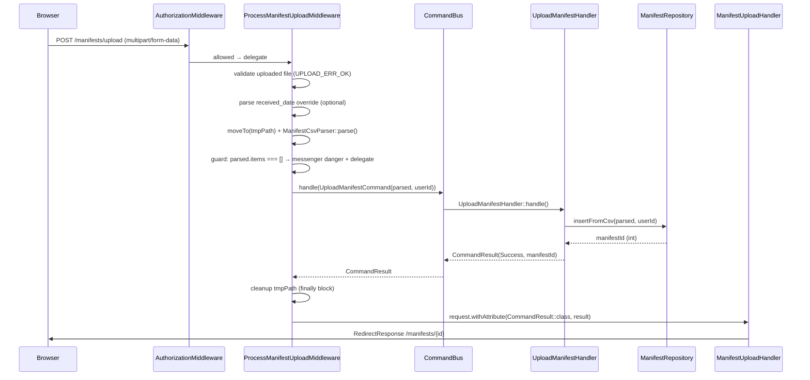

# ims-manifest — Upload Write Path

## Overview

CSV manifest upload is the only write operation in this module. It uses
`webware/command-bus` to decouple the HTTP layer from the persistence logic.

```
ProcessManifestUploadMiddleware  →  UploadManifestCommand  →  UploadManifestHandler  →  ManifestRepository
```

---

## Classes

| Class | Namespace | Role |
|---|---|---|
| `ProcessManifestUploadMiddleware` | `Ims\Manifest\Middleware` | Validates upload, parses CSV, dispatches command |
| `UploadManifestCommand` | `Ims\Manifest\Command` | Immutable value object carrying `ParsedManifest` + `userId` |
| `UploadManifestHandler` | `Ims\Manifest\CommandHandler` | Calls `ManifestRepository::insertFromCsv()`; returns `CommandResult` |
| `ManifestUploadHandler` | `Ims\Manifest\RequestHandler` | Render-only; redirects on success, renders form on failure |

---

## Write Flow



---

## Middleware — Key Decisions

- **Temp file cleanup is always in `finally`** — `unlink($tmpPath)` runs even
  if `insertFromCsv` throws or the command bus throws.
- **Empty CSV guard is pre-bus** — If the parser returns no items the middleware
  returns early (via messenger + delegate) without ever dispatching a command.
  This avoids inserting an empty manifest row.
- **`CommandResult::class` attribute is only set on successful dispatch** — If
  an exception is thrown the handler receives the unmodified request and renders
  the upload form.
- **`received_date` is optional** — If omitted or blank, `$receivedDate` is
  `null` and the repository uses the current date.

---

## Command

```php
final readonly class UploadManifestCommand implements NamedCommandInterface
{
    use NamedCommandTrait;

    public function __construct(
        public ParsedManifest $parsed,
        public int $userId,
    ) {}
}
```

`NamedCommandTrait::getName()` returns `static::class` by default, which is
how the bus resolves the handler via the `command_map` in `ConfigProvider`.

---

## CommandHandler

```php
public function handle(CommandInterface $command): CommandResult
{
    assert($command instanceof UploadManifestCommand);

    $manifestId = $this->manifests->insertFromCsv($command->parsed, $command->userId);

    return new CommandResult($command, CommandStatus::Success, $manifestId);
}
```

`CommandResult::getResult()` carries the new `manifest.id` PK. The handler
does not catch exceptions — they propagate to the middleware's `catch (RuntimeException $e)` block.

---

## Request Handler (render-only)

```php
$commandResult = $request->getAttribute(CommandResult::class);

if ($commandResult instanceof CommandResult && $commandResult->getStatus() === CommandStatus::Success) {
    $manifestId = (int) $commandResult->getResult();
    return new RedirectResponse('/manifests/' . $manifestId);
}

// GET or failed POST — render the upload form
return new HtmlResponse($this->template->render('manifest::upload'));
```

On `CommandStatus::Success` the handler redirects to the manifest detail page
using the PK returned in `CommandResult::getResult()`. Any other case (GET
request or caught exception in middleware) renders the upload form.

---

## DI Registration

`ConfigProvider::getBusConfig()` registers the command → handler mapping:

```php
BusProvider::COMMAND_MAP_KEY => [
    UploadManifestCommand::class => UploadManifestHandler::class,
],
```

`getDependencies()` registers `UploadManifestHandler` via its factory:

```php
CommandHandler\UploadManifestHandler::class => CommandHandler\Container\UploadManifestHandlerFactory::class,
```

The factory injects `ManifestRepositoryInterface`.
