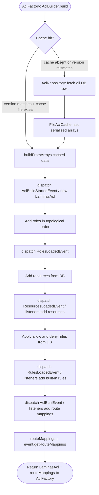
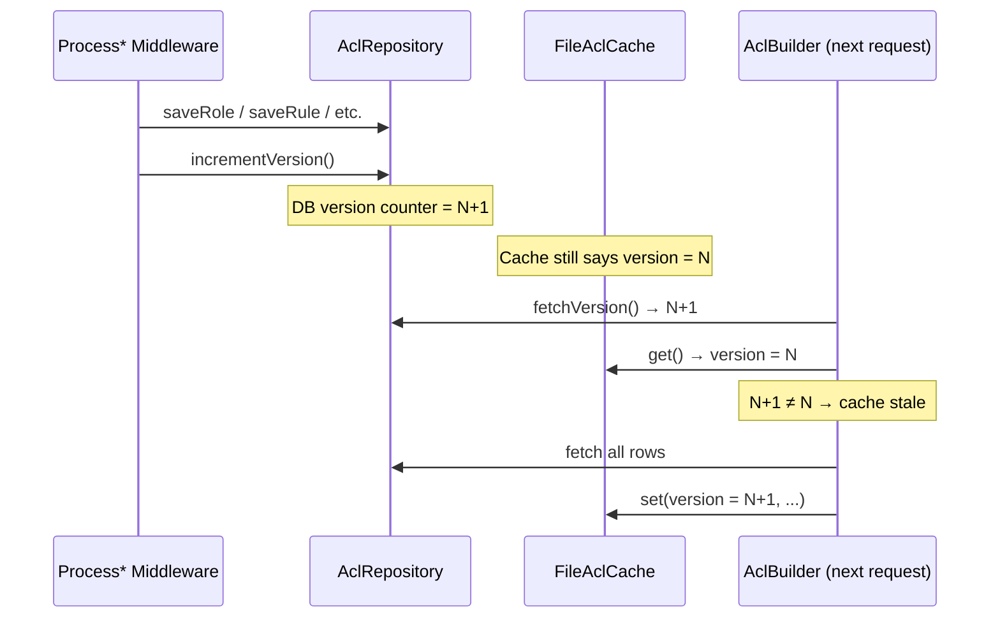
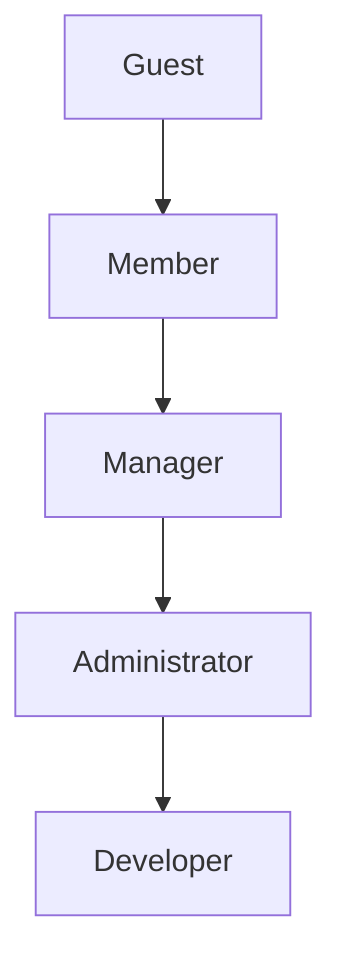

# ACL Build Pipeline

The ACL is built once per application lifecycle (or once per cache-invalidation
cycle). `AclBuilder` orchestrates the entire process: reading from the database,
firing PSR-14 events so modules can extend the ACL, assembling the
`Laminas\Permissions\Acl\Acl` object, and writing a serialised cache file so
subsequent requests pay only the cost of one `fetchVersion()` query.

---

## Overview Diagram



---

## Events Reference

Five events are dispatched in sequence on every build (cache hit or miss).
Listeners registered via `ConfigProvider::getListeners()` extend the ACL without
modifying `AclBuilder`.

### `AclBuildStartedEvent`

Fired immediately after `new LaminasAcl()` and before any roles are added.

```php
namespace Webware\Acl\Event;

final class AclBuildStartedEvent
{
    public function __construct(public readonly Acl $acl) {}
}
```

**Use case**: Rarely needed. Useful for diagnostics or pre-build setup. No
standard listener in the codebase calls this event.

---

### `RolesLoadedEvent`

Fired after all roles (and their parent inheritance) have been added to the
Laminas Acl from DB data.

```php
final class RolesLoadedEvent
{
    public function __construct(public readonly Acl $acl) {}
}
```

**Use case**: Rarely needed directly. Roles are managed entirely through the DB;
listener-added roles are not typical. The event exists as a hook point.

---

### `ResourcesLoadedEvent`

Fired after all DB resources have been added via `$acl->addResource()`. Listeners
add component-specific resources.

```php
final class ResourcesLoadedEvent
{
    public function __construct(public readonly Acl $acl) {}
}
```

**Listener pattern**:

```php
final class RegisterManifestResourcesListener
{
    public function __invoke(ResourcesLoadedEvent $event): void
    {
        $event->acl->addResource('manifest');
    }
}
```

> Every component that protects any route must add at least one resource here.

---

### `RulesLoadedEvent`

Fired after all DB allow/deny rules have been applied to the Laminas Acl.
Listeners add hard-coded, non-DB-manageable rules.

```php
final class RulesLoadedEvent
{
    public function __construct(public readonly Acl $acl) {}
}
```

**Listener pattern**:

```php
final class RegisterManifestRulesListener
{
    public function __invoke(RulesLoadedEvent $event): void
    {
        // Developer always gets full access — not configurable via Admin UI
        $event->acl->allow('Developer', 'manifest', [
            PrivilegeInterface::READ,
            PrivilegeInterface::CREATE,
            PrivilegeInterface::UPDATE,
            PrivilegeInterface::DELETE,
        ]);
    }
}
```

> Rules added here override DB rules if they conflict. Restrict this to
> built-in grants that must be immutable (e.g. Developer super-access).

---

### `AclBuiltEvent`

Fired last — after all rules are applied and before the build returns. Listeners
register route→resource+privilege mappings. The `AclBuilder` reads back the
accumulated mappings via `event->getRouteMappings()`.

```php
final class AclBuiltEvent
{
    public function __construct(
        public readonly Acl $acl,
        array $routeMappings = [],   // DB-loaded mappings passed in
    ) {}

    public function addRouteMapping(
        string $routeName,
        string $resourceId,
        string $privilegeId
    ): void { ... }

    public function getRouteMappings(): array { ... }
}
```

**Listener pattern**:

```php
final class RegisterManifestRouteMappingsListener
{
    public function __invoke(AclBuiltEvent $event): void
    {
        $event->addRouteMapping('manifest.list',         'manifest', PrivilegeInterface::READ);
        $event->addRouteMapping('manifest.detail',       'manifest', PrivilegeInterface::READ);
        $event->addRouteMapping('manifest.upload',       'manifest', PrivilegeInterface::READ);
        $event->addRouteMapping('manifest.upload.store', 'manifest', PrivilegeInterface::CREATE);
    }
}
```

> Every protected route **must** appear here. Routes with no mapping are
> treated as unprotected by `Acl::isAllowedByRouteName()` but are treated as
> **denied** by `Acl::isAllowedRoute()` (returns `false` when no mapping found).

---

## Cache Mechanics

### Cache file

`data/cache/acl.cache` — PHP `serialize`d array with the following shape:

```php
[
    'version'       => int,
    'roles'         => list<array{id: int, role_id: string}>,
    'parents'       => array<int, int[]>,             // child PK → [parent PKs]
    'resources'     => list<array{resource_pk: int, resource_id: string}>,
    'rules'         => list<array{id: int, role_id: string, resource_id: string,
                                  privilege_id: string, type: string}>,
    'assertions'    => array<int, list<array{assertion: string, mode: string, sort_order: int}>>,
    'routeMappings' => array<string, array{resource_id: string, privilege_id: string}>,
]
```

### Version counter

`acl_version` table holds a single integer row. Every write method in
`AclRepository` must call `incrementVersion()` after the write. The next request
reads `fetchVersion()`, compares against the cached version, and triggers a
rebuild if they differ.

```php
// Always pair writes with version increment:
$this->aclRepository->saveRole($roleId, $parentPk);
$this->aclRepository->incrementVersion();   // ← mandatory
```

### Cache invalidation flow



---

## Role Inheritance & Topological Sort

Roles are added to the Laminas Acl in topological order (ancestors first).
`AclBuilder::addRolesInOrder()` uses a simple iterative sort: roles whose
parents are all already added are registered in each pass until all roles are
placed or a cycle is detected.



A `RuntimeException` is thrown if the inheritance graph contains a cycle or an
unresolvable parent reference, which prevents a silent misconfiguration from
going undetected.

---

## Assertion Support

Rules may be guarded by one or more `Laminas\Permissions\Acl\Assertion\AssertionInterface`
implementations. Assertions add dynamic conditions evaluated at `isAllowed()` time
(e.g. ownership checks: "does the current user own this resource?").

When a rule has multiple assertions, `AclBuilder` wraps them in a
`Laminas\Permissions\Acl\Assertion\AssertionAggregate`:

- **`mode: all`** — all assertions must return `true`
- **`mode: at_least_one`** — at least one assertion must return `true`

Assertions are attached to rules via the Admin UI (Add Assertion modal on the
Rule Manager page) or programmatically via `RegisterOwnershipAssertionListener`.

---

## DI Wiring Summary

```php
// ConfigProvider::getDependencies()
'aliases' => [
    AclInterface::class      => Acl::class,
    AclCacheInterface::class => FileAclCache::class,
    AclRepositoryInterface::class => AclRepository::class,
],
'factories' => [
    Acl::class        => AclFactory::class,        // calls AclBuilder::build()
    AclBuilder::class => AclBuilderFactory::class,
    AclRepository::class => AclRepositoryFactory::class,
    FileAclCache::class  => FileAclCacheFactory::class,
],

// ConfigProvider::getListeners()
ResourcesLoadedEvent::class => [
    ['listener' => RegisterAclResourcesListener::class, 'priority' => 1],
    // host modules register their listeners here too
],
RulesLoadedEvent::class => [
    ['listener' => RegisterAclRulesListener::class, 'priority' => 1],
],
AclBuiltEvent::class => [
    ['listener' => RegisterOwnershipAssertionListener::class, 'priority' => 1],
    ['listener' => RegisterAclRouteMappingsListener::class,   'priority' => 2],
],
```
