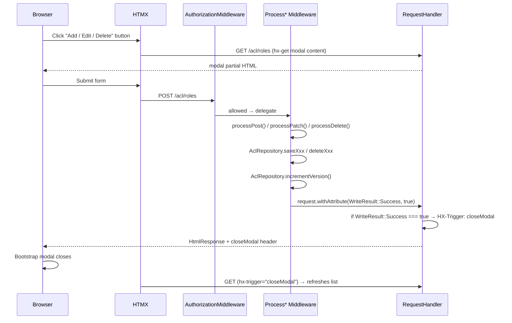
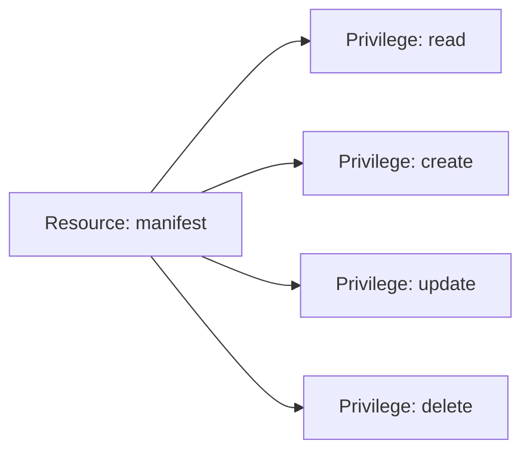
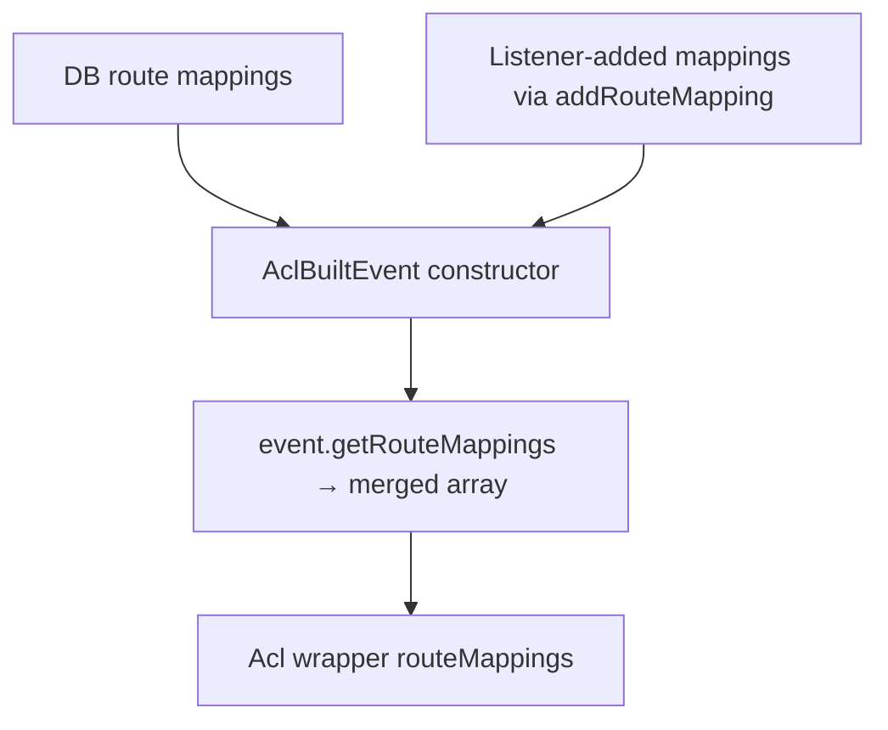

# Admin UI Workflows

The webware-acl Admin UI provides full CRUD management for roles, resources,
privileges, rules, rule assertions, and route mappings. The UI is built with
Bootstrap 5 + HTMX and follows the middleware/handler separation pattern: each
write operation is handled by a `Process*Middleware` class; the downstream
`RequestHandler` is render-only.

---

## Access Control for the Admin UI

The `admin.acl` resource is granted exclusively to the **Developer** role.  
**Administrators cannot manage the ACL** — this is an immutable rule enforced
by `RegisterAclRulesListener` and intentionally absent from the DB, preventing
lockout or privilege escalation via the UI.

---

## Entity Inventory

| Entity | Handler (read) | Middleware (write) |
|---|---|---|
| ACL Overview | `AclOverviewHandler` | — |
| Roles | `RoleListHandler` | `ProcessRoleMiddleware` |
| Resources | `ResourceListHandler` | `ProcessResourceMiddleware` |
| Rules | `RuleManagerHandler` | `ProcessRuleMiddleware` |
| Route Mappings | `RouteMapManagerHandler` | `ProcessRouteMappingMiddleware` |
| Assertions | (inline on Rule Manager page) | `ProcessAssertionMiddleware` |

---

## Generic CRUD Workflow

Every entity follows the same modal-driven pattern:



**Key**: The modal close and list refresh are triggered by the `HX-Trigger:
closeModal` response header set by the handler when `WriteResult::Success`
is `true`. The HTMX swap target refreshes the surrounding list.

---

## Role Management

**Route**: `GET|POST /acl/roles`

### Listing

`RoleListHandler` renders all roles with their parent chain. Each row has:
- **Edit** button → opens modal pre-filled with the role's current parents
- **Delete** button → opens confirmation modal

### Create / Edit

```php
// ProcessRoleMiddleware::processPost()
$roleId = $data['role_id'];    // validated string
$parentPk = (int) $data['parent_pk'];  // 0 = no parent

$this->aclRepository->saveRole($roleId, $parentPk);
$this->aclRepository->incrementVersion();
```

Roles have at most **one** parent in the DB schema (the `role_parent` table
may hold multiple rows, but the UI exposes single-parent inheritance). Cycles
are detected at build time by `AclBuilder::addRolesInOrder()`.

### Delete

A role cannot be deleted if any rules reference it. The repository throws an
exception that `ProcessRoleMiddleware` catches and converts to
`WriteResult::Failure` with an error message via `SystemMessengerInterface`.

---

## Resource & Privilege Management

**Route**: `GET|POST /acl/resources`

Resources and privileges are managed on the same page. A resource is a logical
grouping (e.g. `manifest`). Each resource has one or more privileges
(`read`, `create`, `update`, `delete` — always from `Privilege` constants).



New privileges can be added via the Add Privilege modal on the same page.
`ProcessResourceMiddleware` handles both resource and privilege creation.

---

## Rule Manager

**Route**: `GET|POST /acl/rules`

The Rule Manager page is the most complex page in the Admin UI. It manages
the allow/deny matrix across all roles, resources, and privileges.

### Hierarchy View

When both `?resource` and `?privilege` query parameters are set, the handler
switches to hierarchy view:

```
GET /acl/rules?resource=manifest&privilege=read
```

The handler computes `effective_state` for every role in topological order
(ancestors first), propagating inherited allow/deny downward:

| `effective_state` value | Meaning |
|---|---|
| `explicit_allow` | This role has an explicit `allow` rule for the resource+privilege |
| `explicit_deny` | This role has an explicit `deny` rule |
| `inherited_allow` | No explicit rule; parent grants `allow` |
| `inherited_deny` | No explicit rule; parent grants `deny` |
| `none` | No rule anywhere in ancestry |

**Elevation alert**: Displayed when a child role has an `explicit_allow` while
an ancestor has an `explicit_deny` (or vice versa). Alerts the admin that the
child's explicit rule overrides the inherited one.

**Redundancy alert**: Displayed when a role has an explicit rule that matches
what it would inherit — the explicit rule is unnecessary.

### Adding a rule

```php
// ProcessRuleMiddleware::processPost()
$this->aclRepository->saveRule(
    rolePk:      (int) $data['role_pk'],
    resourcePk:  (int) $data['resource_pk'],
    privilegePk: (int) $data['privilege_pk'],
    type:        $data['type'],   // 'allow' | 'deny'
);
$this->aclRepository->incrementVersion();
```

### Assertions

Assertions are managed via the **Add Assertion** modal triggered from a rule
row. `ProcessAssertionMiddleware` handles the write:

```php
$this->aclRepository->saveAssertion(
    rulePk:    (int) $data['rule_pk'],
    assertion: $data['assertion'],   // FQCN of AssertionInterface implementation
    mode:      $data['mode'],        // 'all' | 'at_least_one'
    sortOrder: (int) $data['sort_order'],
);
$this->aclRepository->incrementVersion();
```

Multiple assertions on a rule are evaluated as an `AssertionAggregate`. The
`mode` and `sort_order` control evaluation strategy and execution order.

---

## Route Mapping Manager

**Route**: `GET|POST /acl/route-mappings`

Maps named routes (from the Mezzio router) to a resource + privilege pair.
Route mappings in the DB are merged with listener-registered mappings at build
time (listeners can extend, not replace, DB mappings).



### Adding a route mapping

```php
// ProcessRouteMappingMiddleware::processPost()
$this->aclRepository->saveRouteMapping(
    routeName:   $data['route_name'],    // e.g. 'manifest.upload.store'
    resourcePk:  (int) $data['resource_pk'],
    privilegePk: (int) $data['privilege_pk'],
);
$this->aclRepository->incrementVersion();
```

> **Note**: Route mappings added via the Admin UI persist to the DB and survive
> cache invalidation. Listener-added mappings are re-added on every rebuild.
> If the same route name appears in both, the DB mapping takes precedence.

---

## Version Increment Rule

**Every write in every `Process*Middleware` must call `incrementVersion()` after
the primary write.** This is not optional — without it, the cache will not
invalidate and other requests will continue using stale ACL data.

```php
// Required pattern — every Process* Middleware write method
try {
    $this->aclRepository->saveXxx(...);
    $this->aclRepository->incrementVersion();   // ← mandatory
    $request = $request->withAttribute(WriteResult::Success->value, true);
} catch (Throwable $e) {
    $messenger?->danger('Failed to save: ' . $e->getMessage());
    $request = $request->withAttribute(WriteResult::Success->value, false);
}
return $handler->handle($request);
```

---

## Handler Pattern

All admin handlers are render-only. They inspect the `WriteResult` attribute
and either close the modal or render the page with fresh data:

```php
public function handle(ServerRequestInterface $request): ResponseInterface
{
    if ($request->getAttribute(WriteResult::Success->value) === true) {
        return new HtmlResponse(
            $this->template->render('acl::role-list', $this->buildViewModel($request)),
            200,
            ['HX-Trigger' => 'closeModal'],
        );
    }

    return new HtmlResponse(
        $this->template->render('acl::role-list', $this->buildViewModel($request)),
    );
}
```

The `HX-Trigger: closeModal` header is read by HTMX on the client. A JavaScript
event listener (in `app.js` or the page's `inlineScript()` block) calls
`bootstrap.Modal.getInstance(el).hide()` in response.

---

## Template Conventions

- Each entity has a list template (`acl/role-list.phtml`) and a modal partial
  (`acl/partials/role-modal.phtml`)
- No inline styles (`style="..."`) — use `.ims-*` CSS classes
- No hardcoded URLs — always use `$this->url('route.name')`
- Edit and Delete buttons carry `hx-get` / `hx-delete` attributes
- Modal forms POST to the same URL as the list page; `AuthorizationMiddleware`
  checks both the GET and POST route stacks separately
