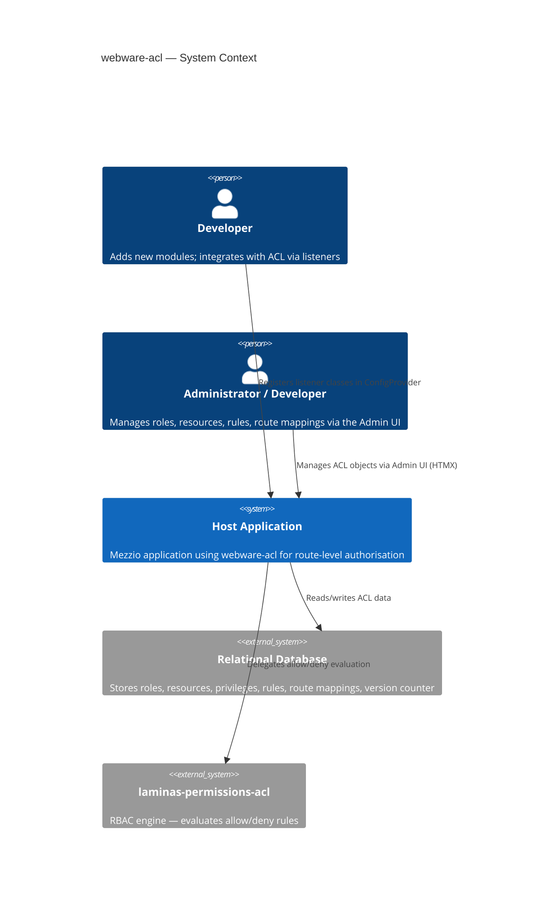
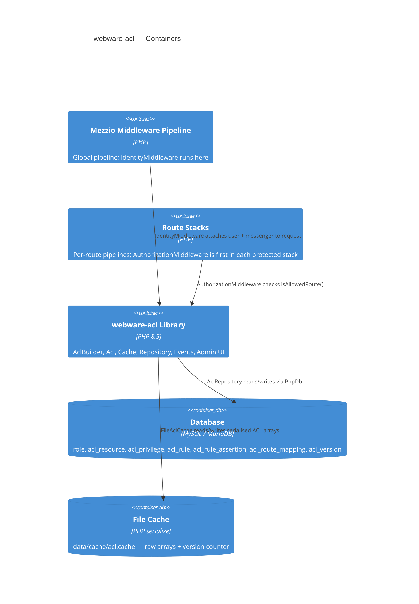
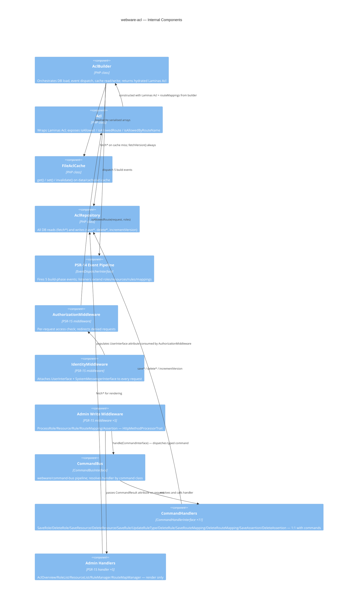
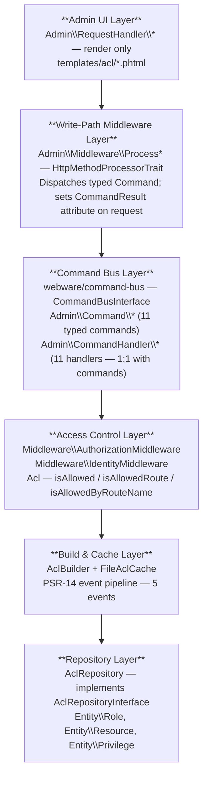
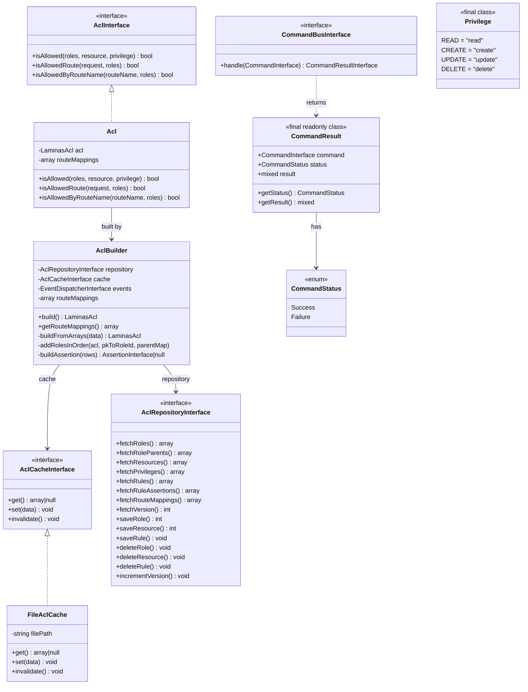
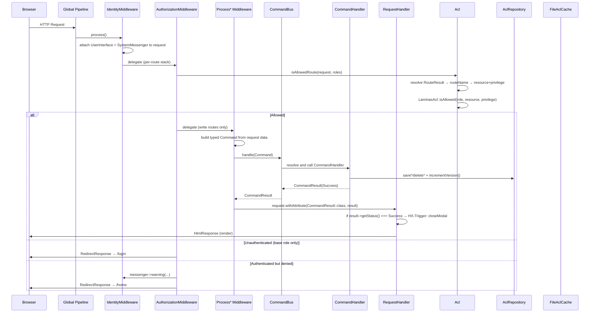
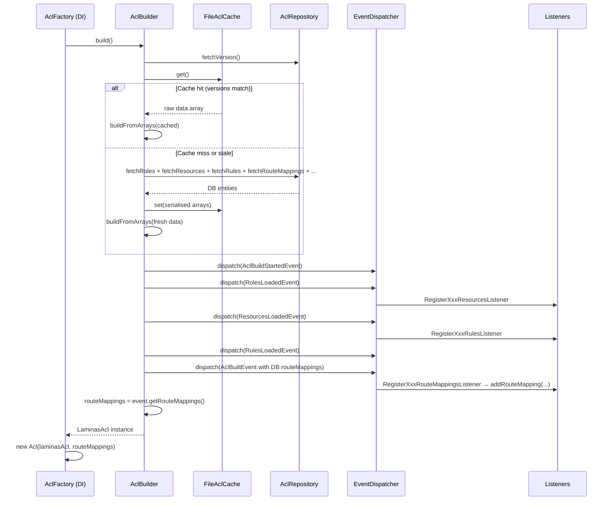
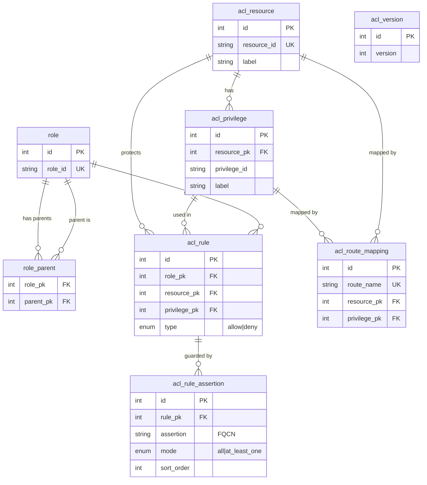

# webware-acl — Architecture Blueprint

## 1. Context (C4 Level 1)

---

## 2. Container Diagram (C4 Level 2)

---

## 3. Component Diagram (C4 Level 3)

---

## 4. Architectural Layers

**Dependency flow is strictly downward.** Handlers depend on repositories and
the template renderer only. Middleware dispatches typed commands to the bus;
command handlers call the repository. Nothing in the lower layers knows about
HTTP requests.

---

## 5. ACL Object Model

---

## 6. Request Lifecycle — Per-Request Flow

---

## 7. ACL Build & Cache Lifecycle

---

## 8. Admin Write Pipeline — Single Write Route

```mermaid
flowchart LR
    A([Browser POST]) --> B[AuthorizationMiddleware]
    B -- allowed --> C[Process* Middleware / HttpMethodProcessorTrait]
    C -- buildCommand --> D["Admin\\Command\\SaveXxxCommand"]
    D --> E[CommandBusInterface.handle]
    E -- resolves --> F["Admin\\CommandHandler\\SaveXxxHandler"]
    F --> G[AclRepository.saveXxx]
    G --> H[AclRepository.incrementVersion]
    H --> I["CommandResult(Success)"]  
    I --> J[withAttribute CommandResult::class]
    J --> K[RequestHandler.handle]
    K -- Success --> L[withHeader HX-Trigger closeModal]
    K --> M([HtmlResponse re-render])
    B -- denied --> N([RedirectResponse])
```

---

## 9. Data Model

---

## 10. Extension Points

| Extension point | How to use |
|---|---|
| Add a new resource | `RegisterXxxResourcesListener` on `ResourcesLoadedEvent` |
| Add built-in rules | `RegisterXxxRulesListener` on `RulesLoadedEvent` |
| Add route mappings | `RegisterXxxRouteMappingsListener` on `AclBuiltEvent` |
| Custom assertion | Implement `Laminas\Permissions\Acl\Assertion\AssertionInterface`; attach to a rule via the Admin UI or `RegisterOwnershipAssertionListener` |
| Alternate cache backend | Implement `AclCacheInterface`; alias in DI config |
| Alternate repository | Implement `AclRepositoryInterface`; alias in DI config |

---

## 11. Architectural Decision Records

### ADR-001 — Use Laminas Permissions ACL as the evaluation engine
**Status**: Accepted  
**Rationale**: Proven RBAC library with hierarchical role inheritance, assertion
support, and `allow`/`deny` semantics. Avoids reimplementing graph traversal and
evaluation logic. Trade-off: tight coupling to Laminas in `AclBuilder`; isolated
behind `AclInterface` for callers.

### ADR-002 — PSR-14 events for the build pipeline
**Status**: Accepted  
**Rationale**: Modules must be able to register ACL data without modifying
`AclBuilder`. PSR-14 events provide a stable contract. Listeners are registered
in each module's `ConfigProvider::getListeners()`. No service locator, no
runtime config merging.

### ADR-003 — File cache with version counter
**Status**: Accepted  
**Rationale**: Zero-infrastructure requirement. PHP `serialize`/`unserialize` on
a local file is adequate for a single-process CLI server or traditional
PHP-FPM deployment. The version counter in the DB (`acl_version` table) provides
a reliable invalidation signal. If the cache file is absent or the version
counter mismatches, a full rebuild runs.

### ADR-004 — Route mappings stored separately from the Laminas Acl
**Status**: Accepted  
**Rationale**: Laminas Acl has no HTTP concept. Route mappings are a thin lookup
table (`route_name → resource_id + privilege_id`) held in the `Acl` wrapper.
This keeps the Laminas layer pure and makes `isAllowedRoute()` a simple two-step
lookup with no Laminas coupling.

### ADR-005 — Middleware processes data; handlers render only
**Status**: Accepted  
**Rationale**: Write operations (`POST`, `PATCH`, `DELETE`) are handled by
`Process*Middleware` classes using `HttpMethodProcessorTrait`. The downstream
`RequestHandler` reads `CommandResult::class` from the request attribute and
renders. This eliminates method-branching in handlers and makes each class
single-responsibility.

### ADR-007 — CommandBus for all admin write operations
**Status**: Accepted  
**Rationale**: Middleware previously called `AclRepository` directly, coupling
HTTP concerns to persistence logic. `webware/command-bus` decouples the
request-parsing layer (`Process*Middleware`) from the write logic
(`CommandHandler`). Each middleware builds a typed, immutable `CommandInterface`
object and dispatches it to the bus. The bus resolves the handler by command
class and calls `handle()`. The `CommandResult` returned by the handler is set
as the `CommandResult::class` request attribute for the downstream
`RequestHandler`. The old `WriteResult` enum was retired.

### ADR-008 — One CommandHandler per Command (1:1)
**Status**: Accepted  
**Rationale**: Handlers that switch on `instanceof` to serve multiple commands
violate the Single Responsibility Principle and complicate testing. Each of the
11 admin commands maps to exactly one dedicated `CommandHandler` class. This
makes handlers trivially testable in isolation (one mock, one assertion path)
and makes the `ConfigProvider` command map self-documenting.

### ADR-006 — Administrators cannot manage their own ACL
**Status**: Accepted  
**Rationale**: `RegisterAclRulesListener` grants ACL management only to the
`Developer` role. Granting `Administrator` write access to the ACL would allow
them to elevate themselves or lock out other admins. This is an immutable rule
not manageable via the Admin UI.
