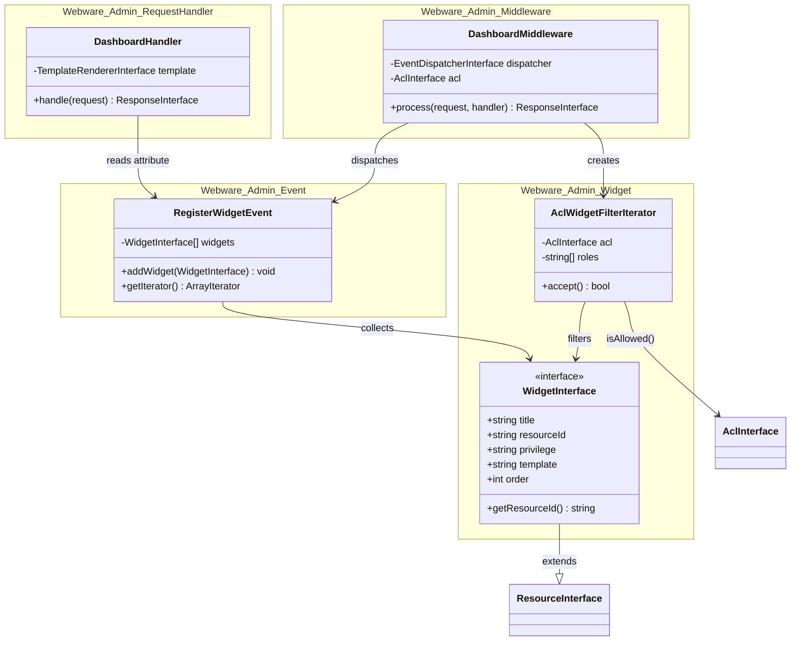
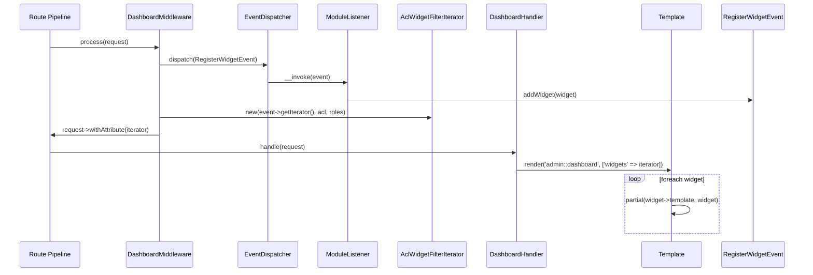

# Admin Dashboard Widget System

A PSR-14 event-driven system that allows any module in the application to contribute widgets to the admin dashboard. Access to each widget is controlled by the ACL. Modules remain fully decoupled — they register a PSR-14 listener; the admin module has no knowledge of them.

## 1. Component Overview

### Purpose / Responsibility

- Provide a standard contract (`WidgetInterface`) that any module can implement to expose an admin dashboard widget.
- Dispatch a mutable `RegisterWidgetEvent` from request middleware so that registered listeners can contribute widgets.
- Filter the collected widgets through the ACL before the dashboard handler ever sees them — widgets the current user cannot access are invisible.
- Allow each module to own its widget's visual rendering by providing a namespaced template path.

### Scope

**Included:**
- `WidgetInterface` contract (PHP 8.4 get-hooked properties)
- `RegisterWidgetEvent` — mutable PSR-14 event listeners call `addWidget()` on
- `DashboardMiddleware` — dispatches the event, filters, sets request attribute
- `AclWidgetFilterIterator` — PHP `FilterIterator` wrapping the ACL check
- `DashboardHandler` — reads the filtered iterator and renders the dashboard template

**Excluded:**
- Concrete widget implementations (each module provides its own)
- Widget template markup (each module provides its own partial template)
- ACL role / resource / privilege definitions (each module registers these via ACL events)

---

## 2. Architecture

### Design Patterns

| Pattern | Where used |
|---|---|
| **Collect Event** (mutable PSR-14 event) | `RegisterWidgetEvent` — listeners push data in |
| **Chain of Responsibility** | Middleware pipeline — `DashboardMiddleware` → `DashboardHandler` |
| **Iterator / FilterIterator** | `AclWidgetFilterIterator` wraps `ArrayIterator<WidgetInterface>` |
| **Interface Segregation** | `WidgetInterface` extends `Laminas\Permissions\Acl\Resource\ResourceInterface` |
| **Factory** | Every service has a corresponding `*Factory` in `Container/` |

### Component Structure



### Request Data Flow



---

## 3. Interface Documentation

### `WidgetInterface`

Extends `Laminas\Permissions\Acl\Resource\ResourceInterface` so widgets can be passed directly to the ACL engine.

| Property / Method | Type | Description |
|---|---|---|
| `$title` | `string` | Display title shown in the widget header |
| `$resourceId` | `string` | ACL resource identifier — must match an ACL resource registered by the module |
| `$privilege` | `string` | ACL privilege required — e.g. `'view'`, `'list'` |
| `$template` | `string` | Namespaced template pair, e.g. `'product::admin-widget'` |
| `$order` | `int` | Sort position — lower values appear first |
| `getResourceId()` | `string` | Required by `ResourceInterface`; return `$this->resourceId` |

All properties must be declared with a `get` hook — PHP 8.4 asymmetric visibility.

### `RegisterWidgetEvent`

| Method | Parameters | Returns | Description |
|---|---|---|---|
| `addWidget()` | `WidgetInterface $widget` | `void` | Appends a widget; called by module listeners |
| `getIterator()` | — | `ArrayIterator<int, WidgetInterface>` | Returns widgets sorted ascending by `$order` |

### `DashboardMiddleware`

Sets the `RegisterWidgetEvent::class` request attribute to an `AclWidgetFilterIterator`. Must be placed in the route pipeline **after** `IdentityMiddleware` so `UserInterface` is already on the request.

### `AclWidgetFilterIterator`

Extends PHP's built-in `FilterIterator`. `accept()` returns `true` when `$acl->isAllowed($roles, $widget->resourceId, $widget->privilege)` passes.

---

## 4. Implementation Details

### Registering a Widget (module side)

**1. Implement `WidgetInterface`:**

```php
namespace Product\Admin\Widget;

use Webware\Admin\Widget\WidgetInterface;

final class ProductsWidget implements WidgetInterface
{
    public string $title      { get => 'Products'; }
    public string $resourceId { get => 'admin.products'; }
    public string $privilege  { get => 'list'; }
    public string $template   { get => 'product::admin-widget'; }
    public int    $order      { get => 10; }

    public function __construct(private readonly int $count) {}

    public function getResourceId(): string
    {
        return $this->resourceId;
    }
}
```

**2. Create a PSR-14 listener:**

```php
namespace Product\Admin\EventListener;

use Product\Admin\Widget\ProductsWidget;
use Product\Repository\ProductRepositoryInterface;
use Webware\Admin\Event\RegisterWidgetEvent;

final class CollectProductWidgetListener
{
    public function __construct(
        private readonly ProductRepositoryInterface $products,
    ) {}

    public function __invoke(RegisterWidgetEvent $event): void
    {
        $event->addWidget(new ProductsWidget($this->products->count()));
    }
}
```

**3. Register the listener in the module `ConfigProvider`:**

```php
'listeners' => [
    RegisterWidgetEvent::class => [
        CollectProductWidgetListener::class,
    ],
],
```

**4. Create the widget partial template** at `templates/admin-widget.phtml`:

```php
<!-- $this is the WidgetInterface instance -->
<div class="col-md-3">
    <div class="card">
        <div class="card-body">
            <h5 class="card-title"><?= $this->escapeHtml($this->title) ?></h5>
            <p class="card-text"><?= (int) $this->count ?></p>
            <a href="<?= $this->url('admin.products') ?>" class="btn btn-sm btn-primary">Manage</a>
        </div>
    </div>
</div>
```

**5. Register the ACL resource and privilege** via ACL events (see `webware-acl` documentation).

### Wiring the Middleware into the Admin Dashboard Route

```php
// In RouteProvider
$app->get('/admin', [
    AuthorizationMiddleware::class,
    DashboardMiddleware::class,
    DashboardHandler::class,
], 'admin.dashboard');
```

### Dashboard Template

```php
<!-- admin/templates/dashboard.phtml -->
<?php foreach ($this->widgets as $widget): ?>
    <?= $this->partial($widget->template, $widget) ?>
<?php endforeach; ?>
```

---

## 5. Quality Attributes

### Security
- Widget visibility is enforced by the ACL before the handler renders — a module widget is never sent to the template if the current user lacks the required resource/privilege.
- `WidgetInterface` extends `ResourceInterface`, so widgets are valid ACL resource objects and can be passed directly to `isAllowed()` without string coercion.

### Performance
- The iterator is lazy — `FilterIterator::accept()` is called only when the template iterates; no up-front array construction of filtered results.
- The `CollectDashboardWidgetsEvent` performs one `usort` on `getIterator()` call.

### Extensibility
- Any module can contribute widgets by registering a single PSR-14 listener. No modification to `webware-admin` is required.
- Widget ordering is controlled by each widget's `$order` value — no central registration or priority numbering.
- Each widget fully owns its template; the dashboard template is layout-only.

### Maintainability
- `DashboardMiddleware` has two injected dependencies (`EventDispatcherInterface`, `AclInterface`) — both are interfaces, fully testable with mocks.
- `AclWidgetFilterIterator` delegates all ACL logic to `AclInterface::isAllowed()` — no ACL implementation leaks into the widget layer.

---

## 6. Reference

### Dependencies

| Dependency | Purpose |
|---|---|
| `psr/event-dispatcher` | `EventDispatcherInterface` injected into middleware |
| `phly/phly-event-dispatcher` | Concrete dispatcher implementation (wired via container) |
| `webware/webware-acl` | `AclInterface` used by `AclWidgetFilterIterator` |
| `laminas/laminas-permissions-acl` | `ResourceInterface` extended by `WidgetInterface` |
| `mezzio/mezzio-authentication` | `UserInterface` read from request attribute |
| `mezzio/mezzio-template` | `TemplateRendererInterface` in `DashboardHandler` |

### Configuration

No dedicated configuration key. Widgets contribute to `config['listeners']` in their own module `ConfigProvider`.

### Testing

- **`DashboardMiddleware`**: mock `EventDispatcherInterface` to return a pre-populated event; assert the request attribute is an `AclWidgetFilterIterator`.
- **`AclWidgetFilterIterator`**: stub `AclInterface::isAllowed()` to return `true`/`false`; assert only permitted widgets are yielded.
- **`RegisterWidgetEvent`**: assert `getIterator()` returns widgets sorted by `$order`.
- **Widget implementations**: construct directly and assert property values.

### Related Documentation

- `src/webware-acl/` — ACL resource and privilege registration
- `docs/planning/` — implementation plan phases
